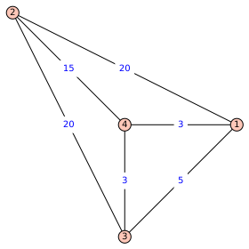

# 3.1 Graphs as models

In this module we will examine models called **graphs**. Graphs represent data with **nodes** (or **vertices**) and **edges** that connect various nodes.

>     
> A graph with 11 nodes and 19 edges.

An edge has no direction and indicates that two nodes are connected or related somehow. Two vertices connected by an edge are said to be **adjacent** or **neighbours**. We will not be looking at vertices with multiple bonds or edges between them; for us two nodes are either adjacent or not.

>     
> A graph where each node is a person in a social network like Facebook, and there is an edge between two nodes only when they are mutual friends.

Graphs are used in many different situations, such as:

>     
> Connecting cities by airlines.

>      
> Connecting websites by hyperlinks.

Sometimes we will refer to the collection of all vertices in a graph, which is called the **vertex set** of that graph. For example, in the airline graph above, the vertex set is `{Denver, Phoenix, Albuqurque, ..., Atlanta}` and it has 15 elements. 

The collection of all edges of a graph is called its **edge set**. In our applications we will often look at vertex sets with the maximum possible set of edges. These graphs are called **complete** and are denoted Kn, where n is the number of vertices.

**Theorem**. A complete graph with n nodes has `n choose 2` edges. That is, it has `n(n-1)/2` edges.

>      
> The complete graphs on 2,3, ..., 7 nodes. Image from [Wolfram MathWorld](http://mathworld.wolfram.com/CompleteGraph.html).

For example, the complete graph on 4 nodes has 6 edges. (You may remember this computation coming up in Module 2 when we computed the number of comparisons needed in the pairwise comparison voting method.)

## Graphs with distances

> 

A graph can also contain information about **distances between nodes** on its edges. This is called a **graph with distances** or a **weighted graph**. These are particularly good at representing data related to travelling, such as with airline travel, or travelling through a city.

>      
> Downtown Calgary

A map of a city *implicitly* is a weighted graph. Each (relevant) location is a node, and the distance between and two locations is the distance it takes to travel from one to the other.

In the map of downtown Calgary above, it would take a significant amount of time for a person to write down all the weights of the edges between the 13+7+11+1+8 = 40 points of interest. (There are `40 choose 2 = 780` total pairs.) As an example, the distance between Fort Calgary (See and Do 8) and the HI Calgary City Centre (Sleep 3) appears to be 5 blocks. Now just find the 779 other distances! (In practice the data is presented in a way that makes it easier to automate.)

A **path** in a graph is a sequence of nodes v1, v2, ..., vk where v1 is adjacent to v2, v2 is adjacent to v3, ..., all the way down to vk-1 is adjacent to vk. You can repeat nodes, or even edges, that's fine. For example, in the airline graph above, Los Angeles, Seattle, Denver, St Louis is a path, but Los Angeles, Seattle, Kansas City, Denver is not a path. (*Why*?) A **circuit** (or closed path) is a path that starts and ends at the same vertex. For example, Denver, Kansas City, Los Angeles, Denver is a circuit.

We often ask Google maps for the **shortest route** between two locations, and this is a classic problem in graph theory called the [shortest path problem](https://en.wikipedia.org/wiki/Shortest_path_problem). It turns out that (maybe unsurprisingly) this problem is pretty easy for computers to solve exactly. In this module we will be looking at a different common problem in distance graphs that is *not* easy for even super-computers to solve exactly.

## Tours

In this module we will explore finding **tours** or circuits that go through each node once. I won't mention them much here, other than to say that the textbook will sometimes mention a type of tour that we will not cover in this class: **Eulerian paths** and **Eulerian Circuits**. These are paths/circuits that go through each *edge* exactly once.

These are very interesting concepts that gave birth to the study of graphs. However, for the sake of time we will omit them.

>      
> Can you walk through the city of Königsberg by crossing each of the seven bridges exactly once? [This is the Königsberg bridge problem.](https://en.wikipedia.org/wiki/Seven_Bridges_of_K%C3%B6nigsberg)

If you're interested, then check out [the five room puzzle](https://en.wikipedia.org/wiki/Five_room_puzzle). A particularly good classroom activity is the class of ["Can you draw this without lifting your pencil?" problems](https://ezgineer.wordpress.com/2015/12/27/draw-without-lifting-pencil-puzzles-euler-paths-circuits/) which are really asking about "Does this graph have an Eulerian path?"

## Exercises

1. In the airline graph above, you want to visit as many cities as possible (using airplanes) without visiting the same city twice. What's the largest number of cities you can visit with this restriction? If you are allowed to visit the same city more than once, what's the smallest number of flights you have to take to visit each city at least once?
2. Computing all 780 edge weights for the graph corresponding to the map of downtown Calgary would be very tedious for a human. Propose a method by which we could automate these computations (perhaps using Excel, or Scratch, or Python). You don't need to actually compute them, but I would like you to propose a method that would work if you *had* to do it.
3. Explore [Braingraph.org](https://braingraph.org/) and the [Human Connectome Project](http://www.humanconnectomeproject.org/). Use the following questions as jumping off points to find topics that interest you or your class: How is a brain represented as a graph? How large (roughly) is such a graph in terms of edges and nodes? What sort of data can you download, and how large are the data sets? What sorts of projects are being done using these graphs? 
4. Graphs can be used to represent relationships between people, such as aquantinces and strangers. There's a remarkable fact called [the party problem](https://en.wikipedia.org/wiki/Theorem_on_friends_and_strangers) which uses graph theory to illustrate it. What does this result say about the game [Sim](https://en.wikipedia.org/wiki/Sim_(pencil_game)) ?
